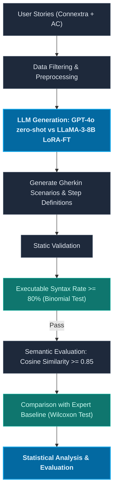

# Phân Tích Khoảng Trống Nghiên Cứu — GAP Analysis (Trịnh Phú Quốc)

Tài liệu này chứa nội dung chi tiết của quy trình phân tích khoảng trống nghiên cứu (GAP Analysis) được thực hiện trên bảng bằng chứng (Evidence Table) cá nhân đã mở rộng gồm **15 bài báo khoa học**.

---

## 1. Bảng phân loại GAP phát hiện

| Loại GAP | Phát hiện từ bảng bằng chứng | Câu hỏi cốt lõi |
|:---|:---|:---|
| **GAP-T (Technology)** | Hầu hết các nghiên cứu đạt hiệu năng cao trong việc sinh kịch bản BDD/Gherkin đều phụ thuộc vào các mô hình thương mại đóng đắt đỏ hoặc các thiết lập multi-agent phức tạp. Khả năng đồng sinh (co-generation) zero-shot của mô hình **GPT-4o** và việc tinh chỉnh (fine-tuning) các mô hình nguồn mở cỡ nhỏ như **LLaMA-3-8B** trên các User Stories thực tế để sinh đồng thời cả kịch bản Gherkin và mã step definition chưa được nghiên cứu đầy đủ. | Công nghệ/Mô hình nào thế hệ mới chưa được đánh giá? |
| **GAP-M (Metric)** | Các nghiên cứu trước đo lường tách biệt: hoặc đo độ tương đồng ngữ nghĩa mức văn bản (Semantic similarity như METEOR, BERTScore), hoặc đo tỷ lệ đúng cú pháp Gherkin tĩnh, chưa có nghiên cứu nào tích hợp bộ độ đo kép đồng thời: **Độ tương đồng ngữ nghĩa (Cosine qua Sentence-Transformers) với một ngưỡng cụ thể ($\ge 0.85$)** kết hợp với **Tỷ lệ đúng cú pháp tĩnh (Executable Syntax Rate $\ge 80\%$)**. | Khía cạnh chất lượng/Độ đo kết hợp nào chưa được sử dụng? |
| **GAP-D (Dataset)** | Các nghiên cứu trước sử dụng các bộ dữ liệu nhỏ lẻ (5 đến 34 mẫu) hoặc dữ liệu tự sinh (synthetic) bằng phương pháp self-instruct (như Selfbehave). Thiếu các nghiên cứu đánh giá trên tập dữ liệu User Stories đa miền Agile quy mô trung bình (ví dụ: 50-100 User Stories) đi kèm đối chứng. | Domain/Quy mô dữ liệu thực nghiệm nào còn thiếu? |
| **GAP-S (Shared Limitation)** | Nhiều nghiên cứu thừa nhận hạn chế về sự phụ thuộc vào cấu trúc prompt template thủ công phức tạp hoặc cấu trúc multi-agent có độ trễ/chi phí API quá cao, chưa đánh giá zero-shot thuần túy của mô hình frontier mạnh nhất. | Hạn chế chung nào được đa số nghiên cứu thừa nhận? |

---

## 2. Kiểm tra phản chứng (Counter-evidence Check)

Để đảm bảo các khoảng trống nghiên cứu đề xuất là hợp lệ và chưa được giải quyết bởi các công trình đi trước, nhóm tiến hành rà soát phản chứng trên cả 15 bài báo thuộc Evidence Table:

### Bảng rà soát phản chứng cho GAP-T và GAP-M

| ID | Paper | Đã làm chưa? | Ghi chú từ Evidence Table |
|:---|:---|:---:|:---|
| 1 | Mendoza 2024 SBES | **Không** | Đánh giá ChatGPT-4, ChatGPT-3.5, Gemini, Copilot trên 5 kịch bản bằng thang đo Likert. |
| 2 | Fernandes 2025 SBES | **Không** | Đánh giá GPT-3.5, GPT-4, LLaMA-3, Phi-3, Gemini, DeepSeek R1 cho việc sinh kịch bản Gherkin bằng METEOR. |
| 3 | dos Santos 2026 SciTePress | **Không** | Đánh giá ChatGPT, Gemini, Grok, GitHub Copilot trên 34 stories. Đo accuracy & AC coverage. |
| 4 | Rathnayake 2026 arXiv | **Không** | Đánh giá GPT-4, Claude 3, Gemini trên 500 stories. Đo tương đồng văn bản nhưng không sinh step definitions. |
| 5 | Karpurapu 2024 IEEE | **Không** | Đánh giá GPT-3.5, GPT-4, Llama-2, PaLM-2. Chỉ đo tỷ lệ đúng cú pháp Gherkin tĩnh qua `gherkin-lint`. |
| 6 | Ferreira 2025 arXiv | **Không** | Đề xuất pipeline sinh Gherkin rồi chuyển thành Cypress script, sử dụng HTML context. Chưa đánh giá zero-shot. |
| 7 | Hasan 2025 arXiv | **Không** | Sinh high-level test cases chứ không phải kịch bản Gherkin và step definition thực thi. |
| 8 | Tesfalidet 2025 DiVA | **Không** | Chỉ đánh giá trên 10-20 stories fintech cụ thể bằng framework Python Behave. |
| 9 | Increasing BDD PoCs 2026 ACM | **Không** | Chỉ đo lường độ phủ mã nguồn (Statement/Branch Coverage) trên 15 ứng dụng web PoC. |
| 10 | Poth 2025 Springer | **Không** | Sinh UI code từ file Gherkin có sẵn, không phải đồng sinh từ User Story. |
| 11 | Selfbehave 2026 IEEE | **Không** | Huấn luyện LLaMA-3-8B nhưng sử dụng dữ liệu tự sinh (synthetic) bằng self-instruct, không phải User Story đa miền thực tế. |
| 12 | Bergsmann 2024 ACM | **Không** | Sử dụng hệ thống nhiều LLM agents cộng tác (Multi-Agent) phức tạp và tiêu tốn token, không phải zero-shot thuần túy. |
| 13 | AutoQALLMs 2026 MDPI | **Không** | Tập trung vào sinh và thực thi Selenium script trên 10 ứng dụng web, không đo độ tương đồng ngữ nghĩa với expert baseline. |
| 14 | Agentic BDD 2026 | **Không** | Đánh giá hệ thống Multi-Agent trên 20 stories thương mại điện tử, chi phí token cao và độ trễ lớn. |
| 15 | Tasarsu 2026 arXiv | **Không** | Là bài báo tổng quan tài liệu (SLR), không có thiết kế thực nghiệm thực tế. |

*   **Kết luận phản chứng:** GAP-T và GAP-M hợp lệ. Không có bài báo nào trong số 15 bài đã rà soát thực hiện đánh giá khả năng sinh đồng thời cả kịch bản Gherkin và step definitions từ User Story sử dụng bộ độ đo kép tích hợp (Cosine Similarity $\ge 0.85$ và Executable Syntax Rate $\ge 80\% / 85\%$).

---

## 3. Chốt GAP nghiên cứu chính

### GAP Chính (Primary GAP - GAP-T):
> **Tuyên bố GAP chính:** Các nghiên cứu hiện tại về sinh kiểm thử tự động chấp nhận (BDD/Gherkin) chủ yếu tập trung vào việc sinh kịch bản Gherkin hoặc sinh mã kiểm thử ở các giai đoạn riêng biệt. Chưa có nghiên cứu nào đánh giá toàn diện khả năng sinh đồng thời (co-generation) cả kịch bản Gherkin và mã step definitions từ User Stories định dạng Connextra bằng các mô hình ngôn ngữ lớn hiện đại.

### GAP Phụ (Secondary GAP - GAP-M):
> **Tuyên bố GAP phụ:** Chưa có nghiên cứu nào sử dụng bộ đánh giá tĩnh tích hợp kép để đánh giá đồng thời cả độ tương đồng ngữ nghĩa Cosine Similarity (Sentence-Transformers so với expert baseline $\ge 0.85$) và tính đúng đắn cú pháp tĩnh (Executable Syntax Rate $\ge 80\%$).

### GAP Hỗ trợ (Supporting GAP - GAP-D):
> **Tuyên bố GAP hỗ trợ:** Thiếu các đánh giá thực nghiệm trên các bộ dữ liệu yêu cầu thực tế Agile đa miền có kích thước trung bình và lớn (ví dụ: 50-100 User Stories) để kiểm chứng tính tổng quát hóa của mô hình nguồn mở cỡ nhỏ (LLaMA-3-8B) sau khi tinh chỉnh qua LoRA.

---

## 4. Feasibility Check (Đánh giá tính khả thi)

| Tiêu chí | Mức độ | Rationale / Lý do chi tiết |
|:---|:---:|:---|
| **Dataset (Dữ liệu)** | **High** | Bộ dữ liệu gồm 50 User Stories định dạng Connextra đa miền (E-commerce, FinTech, v.v.) đi kèm baseline đã có sẵn hoặc xây dựng từ các dự án môn học. |
| **Tool/API (Công cụ)** | **High** | API GPT-4o và mô hình nhúng SBERT (`all-MiniLM-L6-v2`) đều sẵn có, chi phí thấp. Các công cụ parser cú pháp (như thư viện AST và Gherkin parser của Python) đều là mã nguồn mở. |
| **Compute (Tài nguyên)** | **High** | Chạy mô hình nhúng SBERT và parser cú pháp tĩnh chỉ tốn vài giây trên một máy tính cá nhân thông thường. |
| **Ground Truth (Đáp án)** | **High** | Bộ ca kiểm thử BDD viết tay của chuyên gia (Expert-written baseline) xây dựng dựa trên bài giải mẫu hoặc nhờ các sinh viên xuất sắc thực hiện. |
| **Skills (Kỹ năng)** | **High** | Sinh viên đã được trang bị kỹ năng lập trình Python, gọi API, sử dụng thư viện sentence-transformers và hiểu biết về BDD/Gherkin. |
| **Thời gian** | **High** | Thực nghiệm có thể thực hiện trong vòng 1-2 tuần, nằm trong khung thời gian cho phép của môn học. |
| **Contribution (Đóng góp)** | **High** | Kết quả thực nghiệm cung cấp một báo cáo thực tế, có số liệu đối chứng khoa học giúp lựa chọn mô hình/cách prompt tối ưu. |

*   **Quyết định:** Tất cả các tiêu chí đều đạt mức **High**, không có rủi ro nào lớn. Thiết kế thực nghiệm khả thi.

### 5. Sơ đồ quy trình thực nghiệm (Pipeline Architecture)

