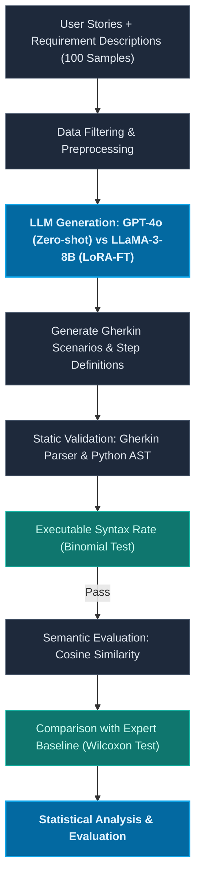

# Phân Tích Khoảng Trống Nghiên Cứu — GAP Analysis (Team Synthesis)

Tài liệu này chứa nội dung chi tiết của quy trình phân tích khoảng trống nghiên cứu (GAP Analysis) được thực hiện trên bảng bằng chứng (Evidence Table) tổng hợp gồm **15 bài báo khoa học**.

---

## 1. Bảng phân loại GAP phát hiện

| Loại GAP | Phát hiện từ bảng bằng chứng | Câu hỏi cốt lõi |
|:---|:---|:---|
| **GAP-T (Technology)** | **GAP-T: Co-generation of Gherkin Scenarios and Step Definitions from Connextra User Stories using modern LLMs.** Các nghiên cứu hiện tại về tự động sinh kiểm thử BDD chủ yếu tập trung vào việc sinh Gherkin Scenarios độc lập từ User Stories hoặc Requirement Descriptions. Tuy nhiên, chưa có nghiên cứu nào đánh giá toàn diện khả năng sinh đồng thời (co-generation) cả Gherkin Scenarios và Step Definitions từ Connextra User Stories bằng các mô hình LLM hiện đại. Vì vậy, nghiên cứu này chọn GAP-T làm khoảng trống chính, với GPT-4o Zero-shot làm baseline đối chứng và LLaMA-3-8B LoRA-FT làm mô hình can thiệp chính. | Công nghệ/Mô hình nào thế hệ mới chưa được đánh giá? |
| **GAP-M (Metric)** | Các nghiên cứu trước đo tương đồng ngữ nghĩa hoặc kiểm tra cú pháp một cách riêng lẻ. **Chưa có nghiên cứu nào sử dụng đồng thời Gherkin Parser Validation và Python AST Validation như một cơ chế Static Validation kép trước khi đánh giá Cosine Similarity.** | Khía cạnh chất lượng/Độ đo kết hợp nào chưa được sử dụng? |
| **GAP-D (Dataset)** | Các nghiên cứu trước hầu hết sử dụng các bộ dữ liệu nhỏ lẻ tự xây dựng (5 đến 34 mẫu) hoặc dữ liệu tự sinh (synthetic) bằng AI. Thiếu các nghiên cứu đánh giá trên dữ liệu Agile thực tế đa miền từ doanh nghiệp. Nghiên cứu này sử dụng dataset gốc gồm 500 User Stories của Rathnayake et al. (2026) và tiến hành rút mẫu thực nghiệm ngẫu nhiên 100 mẫu. | Domain/Quy mô dữ liệu thực nghiệm nào còn thiếu? |
| **GAP-S (Shared Limitation)** | Nhiều nghiên cứu thừa nhận hạn chế về sự phụ thuộc vào cấu trúc prompt template thủ công phức tạp hoặc cấu trúc multi-agent có độ trễ/chi phí API quá cao, chưa đánh giá zero-shot thuần túy của mô hình frontier mạnh nhất trên bài toán sinh đồng thời cả kịch bản và mã code. | Hạn chế chung nào được đa số nghiên cứu thừa nhận? |

---

## 2. Kiểm tra phản chứng (Counter-evidence Check)

Để đảm bảo các khoảng trống nghiên cứu đề xuất là hợp lệ và chưa được giải quyết bởi các công trình đi trước, nhóm tiến hành rà soát phản chứng trên cả 15 bài báo thuộc Evidence Table:

### Bảng rà soát phản chứng cho GAP-T và GAP-M

| ID | Paper | Đã làm chưa? | Ghi chú từ Evidence Table |
|:---|:---|:---:|:---|
| 1 | Mendoza 2024 SBES | **Không** | Đánh giá ChatGPT-4, ChatGPT-3.5, Gemini, Copilot trên 5 kịch bản bằng thang đo Likert. |
| 2 | Fernandes 2025 SBES | **Không** | Đánh giá GPT-3.5, GPT-4, LLaMA-3, Phi-3, Gemini, DeepSeek R1 cho việc sinh kịch bản Gherkin bằng METEOR. |
| 3 | dos Santos 2026 SciTePress | **Không** | Đánh giá ChatGPT, Gemini, Grok, GitHub Copilot trên 34 stories. Đo accuracy & AC coverage. |
| 4 | Rathnayake 2026 arXiv | **Một phần** | Đóng vai trò nền tảng. Đã sinh kịch bản Gherkin và đo tương đồng ngữ nghĩa trên 500 stories, nhưng **chưa sinh Step Definitions** và **chưa có bước Static Validation kép**. |
| 5 | Karpurapu 2024 IEEE | **Không** | Đánh giá GPT-3.5, GPT-4, Llama-2, PaLM-2. Chỉ đo tỷ lệ đúng cú pháp Gherkin tĩnh qua `gherkin-lint`. |
| 6 | Ferreira 2025 arXiv | **Không** | Đề xuất pipeline sinh Gherkin rồi chuyển thành Cypress script, sử dụng HTML context. Chưa đánh giá zero-shot. |
| 7 | Hasan 2025 arXiv | **Không** | Sinh high-level test cases chứ không phải kịch bản Gherkin và step definition thực thi. |
| 8 | Tesfalidet 2025 DiVA | **Không** | Chỉ đánh giá trên 10-20 stories fintech cụ thể bằng framework Python Behave. |
| 9 | Increasing BDD PoCs 2026 ACM | **Không** | Chỉ đo lường độ phủ mã nguồn (Statement/Branch Coverage) trên 15 ứng dụng web PoC. |
| 10 | Poth 2025 Springer | **Không** | Sinh UI code từ file Gherkin có sẵn, không phải đồng sinh từ User Story. |
| 11 | Selfbehave 2026 IEEE | **Không** | Huấn luyện LLaMA-3-8B nhưng sử dụng dữ liệu tự sinh (synthetic) bằng self-instruct, không phải User Story đa miền thực tế. |
| 12 | Bergsmann 2024 ACM | **Không** | Sử dụng hệ thống nhiều LLM agents cộng tác (Multi-Agent) phức tạp và tiêu tốn token, không phải zero-shot thuần túy. |
| 13 | AutoQALLMs 2026 MDPI | **Không** | Tập trung vào sinh và thực thi Selenium script trên 10 ứng dụng web, không đo độ tương đồng ngữ nghĩa với expert baseline. |
| 14 | Agentic BDD 2026 | **Không** | Đánh giá hệ thống Multi-Agent trên 20 stories thương mại điện tử, chi phí token cao và độ trễ lớn. |
| 15 | Tasarsu 2026 arXiv | **Không** | Là bài báo tổng quan tài liệu (SLR), không có thiết kế thực nghiệm thực tế. |

*   **Kết luận phản chứng:** GAP-T và GAP-M hợp lệ. Không có bài báo nào trong số 15 bài đã rà soát thực hiện đánh giá khả năng sinh đồng thời cả kịch bản Gherkin và step definitions từ User Story sử dụng bộ độ đo kép tích hợp (Gherkin Parser và Python AST) và đánh giá độ tương đồng ngữ nghĩa.

---

## 3. Chốt GAP nghiên cứu chính

### GAP Chính (Primary GAP - GAP-T):
> **Tuyên bố GAP chính:** GAP-T: Co-generation of Gherkin Scenarios and Step Definitions from Connextra User Stories using modern LLMs.
> 
> *Chi tiết:* Các nghiên cứu hiện tại về tự động sinh kiểm thử BDD chủ yếu tập trung vào việc sinh Gherkin Scenarios độc lập từ User Stories hoặc Requirement Descriptions. Tuy nhiên, chưa có nghiên cứu nào đánh giá toàn diện khả năng sinh đồng thời (co-generation) cả Gherkin Scenarios và Step Definitions từ Connextra User Stories bằng các mô hình LLM hiện đại. Vì vậy, nghiên cứu này chọn GAP-T làm khoảng trống chính, với GPT-4o Zero-shot làm baseline đối chứng và LLaMA-3-8B LoRA-FT làm mô hình can thiệp chính.

### GAP Phụ (Secondary GAP - GAP-M):
> **Tuyên bố GAP phụ:** Chưa có nghiên cứu nào sử dụng đồng thời Gherkin Parser Validation và Python AST Validation như một cơ chế Static Validation kép trước khi đánh giá Cosine Similarity.

### GAP Hỗ trợ (Supporting GAP - GAP-D):
> **Tuyên bố GAP hỗ trợ:** Dataset gốc gồm 500 User Stories, 500 Requirement Descriptions và 500 Manual BDD Scenarios từ Rathnayake et al. (2026). Dataset thực nghiệm sử dụng mẫu ngẫu nhiên 100 mẫu để tiến hành đối chứng thực nghiệm giữa mô hình LLaMA-3-8B (LoRA-FT) và GPT-4o (Zero-shot) nhằm tránh thiên kiến dữ liệu tự sinh.

---

## 4. Feasibility Check (Đánh giá tính khả thi)

| Tiêu chí | Mức độ | Rationale / Lý do chi tiết |
|:---|:---|:---|
| **Dataset (Dữ liệu)** | **High** | Sử dụng mẫu ngẫu nhiên 100 mẫu từ bộ dữ liệu công khai 500 User Stories thực tế đa miền của Rathnayake et al. (2026). |
| **Tool/API (Công cụ)** | **High** | API GPT-4o và mô hình nhúng SBERT (`all-MiniLM-L6-v2`) đều sẵn có. Các công cụ parser cú pháp (Gherkin parser và Python AST module) đều là thư viện chuẩn nguồn mở. |
| **Compute (Tài nguyên)** | **High** | Chạy mô hình nhúng SBERT và parser cú pháp tĩnh chỉ tốn vài giây trên một máy tính cá nhân thông thường. Tinh chỉnh LoRA LLaMA-3-8B có thể thực hiện trên GPU Google Colab hoặc GPU Kaggle miễn phí. |
| **Ground Truth (Đáp án)** | **High** | Đã có sẵn 500 Manual BDD Scenarios viết tay đi kèm bộ dữ liệu của Rathnayake et al. (2026) (tập thực nghiệm sẽ lấy tương ứng 100 kịch bản làm đối chứng). |
| **Skills (Kỹ năng)** | **High** | Sinh viên đã được trang bị kỹ năng lập trình Python, gọi API, sử dụng thư viện sentence-transformers và hiểu biết về BDD/Gherkin. |
| **Thời gian** | **High** | Thực nghiệm sử dụng dataset có sẵn giúp tiết kiệm thời gian gán nhãn, hoàn toàn khả thi trong 1-2 tuần. |
| **Contribution (Đóng góp)** | **High** | Kết quả thực nghiệm cung cấp số liệu đối chứng khoa học, mở rộng trực tiếp công trình nền tảng Rathnayake et al. (2026). |

---

## 5. Chi tiết quy trình Static Validation và Executable Syntax Rate

### 5.1. Cơ chế kiểm định tĩnh kép (Static Validation)
Quy trình Static Validation gồm 2 bước độc lập nhằm kiểm tra lỗi cú pháp tĩnh trước khi chuyển giao artifacts sang đánh giá ngữ nghĩa nghiệp vụ:

#### A. Gherkin Parser Validation
*   **Đối tượng áp dụng:** Các kịch bản Gherkin Scenarios sinh ra (`.feature` files).
*   **Nội dung kiểm tra:** Kiểm định cấu trúc cú pháp của file `.feature` bao gồm các từ khóa định nghĩa chuẩn: `Feature`, `Scenario`, `Given`, `When`, `Then`, `And`, `But`.
*   **Kết quả trả về:**
    *   **PASS:** Gherkin Scenario parse được và hợp lệ cú pháp.
    *   **FAIL:** Gherkin Scenario có chứa lỗi cú pháp.

#### B. Python AST Validation
*   **Đối tượng áp dụng:** Các định nghĩa bước sinh ra (`step_definitions` Python files).
*   **Nội dung kiểm tra:** Sử dụng module `ast` của Python để phân tích cây cú pháp tĩnh (Abstract Syntax Tree), kiểm tra: cấu trúc hàm định nghĩa bước (Function definition), tính hợp lệ của dấu đóng mở ngoặc (Parentheses), dấu hai chấm (Colon), thụt dòng (Indentation), và các lỗi Python syntax khác thông qua hàm `ast.parse()`.
*   **Kết quả trả về:**
    *   **PASS:** Step Definition parse được thành công bằng Python AST.
    *   **FAIL:** Step Definition gây ra lỗi `SyntaxError`.

---

### 5.2. Công thức tính Executable Syntax Rate
Executable Syntax Rate được tính trên các artifacts do mô hình sinh ra, bao gồm Gherkin Scenarios và Step Definitions. Chỉ số này không cần Ground Truth Step Definitions vì mục tiêu của nó chỉ là kiểm tra tính hợp lệ cú pháp tĩnh, không đánh giá đúng sai nghiệp vụ.

$$\text{Executable Syntax Rate} = \frac{\text{Number of PASS artifacts}}{\text{Total generated artifacts}}$$

*artifacts được coi là PASS khi cả Gherkin Scenarios và Step Definitions đi kèm đều đạt kết quả PASS tĩnh.*

---

## 6. Sơ đồ quy trình thực nghiệm (Pipeline Architecture)

