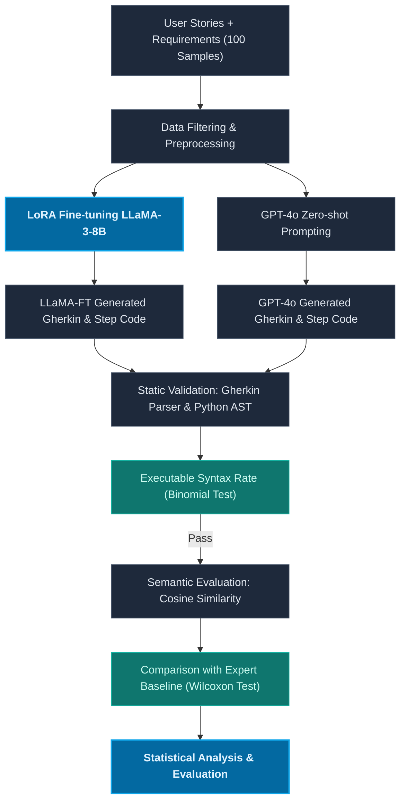

# Câu Hỏi Nghiên Cứu Chính Thức — Research Questions & PICO (Final)

Tài liệu này trình bày các câu hỏi nghiên cứu chính thức (RQs) và cấu trúc khung PICO của thực nghiệm nhóm, được tinh chỉnh dựa trên bằng chứng khoa học rút ra từ bảng bằng chứng (Evidence Table) gồm 37 bài báo.

---

## 1. Câu hỏi nghiên cứu (Research Questions)

### Câu hỏi nghiên cứu chính (Main RQ)
> **Main RQ:** Can a LoRA fine-tuned LLaMA-3-8B co-generate Gherkin scenarios and step definitions that achieve semantic similarity $\ge 0.85$ and executable syntax rate $\ge 85\%$, while providing performance comparable to GPT-4o zero-shot generation?
> 
> *(Bản dịch tiếng Việt: Khi áp dụng trên bộ dữ liệu User Stories viết theo định dạng Connextra và mô tả yêu cầu thực tế, liệu mô hình LLaMA-3-8B được tinh chỉnh bằng phương pháp LoRA có khả năng đồng sinh kịch bản Gherkin và mã kiểm thử đạt độ tương đồng ngữ nghĩa $\ge 0.85$ và tỷ lệ cú pháp tĩnh khả thi $\ge 85\%$, đồng thời mang lại hiệu năng tương đương với thế hệ zero-shot của GPT-4o hay không?)*

### Các câu hỏi nghiên cứu phụ (Sub-RQs)
*   **RQ1 (Semantic Similarity - Độ tương đồng ngữ nghĩa):** Mô hình LLaMA-3-8B (Fine-tuned via LoRA) có đạt độ tương đồng ngữ nghĩa trung bình (Cosine Similarity sử dụng mô hình nhúng `all-MiniLM-L6-v2`) từ **0.85 trở lên** so với bộ kịch bản kiểm thử viết tay của chuyên gia (Ground Truth) hay không?
*   **RQ2 (Executable Syntax Rate - Tỷ lệ cú pháp tĩnh khả thi):** Mô hình LLaMA-3-8B (Fine-tuned via LoRA) có đạt tỷ lệ hợp lệ cú pháp tĩnh (Executable Syntax Rate) từ **85% trở lên** (không xảy ra lỗi phân tích cú pháp tĩnh từ Gherkin Parser và Python AST Parser) hay không?
*   **RQ3 (Comparative Evaluation - Đánh giá so sánh):** Is there a statistically significant difference between LLaMA-3-8B LoRA-FT and GPT-4o in semantic similarity and executable syntax rate? (Có sự khác biệt có ý nghĩa thống kê về độ tương đồng ngữ nghĩa và tỷ lệ cú pháp tĩnh khả thi giữa LLaMA-3-8B LoRA-FT và GPT-4o zero-shot hay không?)

---

## 2. Khung phân tích PICO (PICO Framework)

Dưới đây là bảng đặc tả chi tiết khung PICO của nhóm, được xác lập dựa trên các tham chiếu thực nghiệm tối ưu thu được từ SLR:

| Thành phần PICO | Đặc tả chi tiết cho thực nghiệm nhóm | Cơ sở khoa học / Tham chiếu từ SLR |
|:---|:---|:---|
| **P — Population (Đối tượng)** | **Dataset nguồn**: - Rathnayake et al. (2026) - 500 User Stories, 500 Requirement Descriptions, 500 Manual BDD Scenarios  **Dataset thực nghiệm**: - Rút mẫu ngẫu nhiên **100 samples** từ tập 500 mẫu. | *Quy mô & Đa miền:* Khắc phục hạn chế của các nghiên cứu trước thường chỉ thử nghiệm trên tập dữ liệu đóng rất nhỏ hoặc đơn miền, sử dụng benchmark 100 mẫu đa miền thực tế từ doanh nghiệp. |
| **I — Intervention (Can thiệp)** | Quy trình sinh đồng thời (co-generation) kịch bản Gherkin và mã step definitions bằng mô hình nguồn mở cỡ nhỏ **LLaMA-3-8B** được tinh chỉnh bằng phương pháp **LoRA** (với $temperature = 0$ để đảm bảo tính tái lập). | *Mô hình & Phương pháp:* Tinh chỉnh LLaMA-3-8B (tương tự định hướng Paper 27 - Selfbehave) nhưng tối ưu hóa trên dữ liệu User Stories thực tế thay vì dữ liệu tự sinh. |
| **C — Comparison (Đối chứng)** | Đối chứng trực tiếp với: 1. Mô hình đóng hàng đầu: **GPT-4o** sử dụng zero-shot prompting. 2. Bộ kịch bản và mã test viết tay chuẩn mực từ dataset công khai của Rathnayake et al. 2026 (**Ground Truth**). | *Mô hình so sánh:* GPT-4o zero-shot đại diện cho giới hạn hiệu năng của mô hình đóng (Paper 19 đạt Cosine = 0.85; Paper 21 đạt UI compilation = 88.0%). |
| **O — Outcome (Kết quả đo lường)** | **Metric 1: Cosine Semantic Similarity** (qua mô hình nhúng `all-MiniLM-L6-v2`) $\ge 0.85$ so với Ground Truth. **Metric 2: Executable Syntax Rate** (tỷ lệ cú pháp Gherkin và step code không lỗi parser tĩnh) $\ge 85\%$. | *Ngưỡng chất lượng:* Ngưỡng Cosine Similarity $\ge 0.85$ lấy từ kết quả tối ưu của Paper 19 (đạt 0.85) và Paper 33 (đạt 85%). Ngưỡng cú pháp tĩnh $\ge 85\%$ lấy từ Paper 8 (đạt 85% executable steps) và Paper 11 (Selfbehave đạt 99.2%). |

---

## 3. Quy trình thực nghiệm và Luồng dữ liệu (Input/Output)

*   **Đầu vào thực nghiệm:** 100 User Stories định dạng Connextra (kèm mô tả tiêu chí nghiệm thu và yêu cầu).
*   **Đầu ra thực nghiệm:**
    *   Kịch bản đặc tả hành vi (Gherkin features).
    *   Mã nguồn step definitions tương ứng viết bằng Python.
